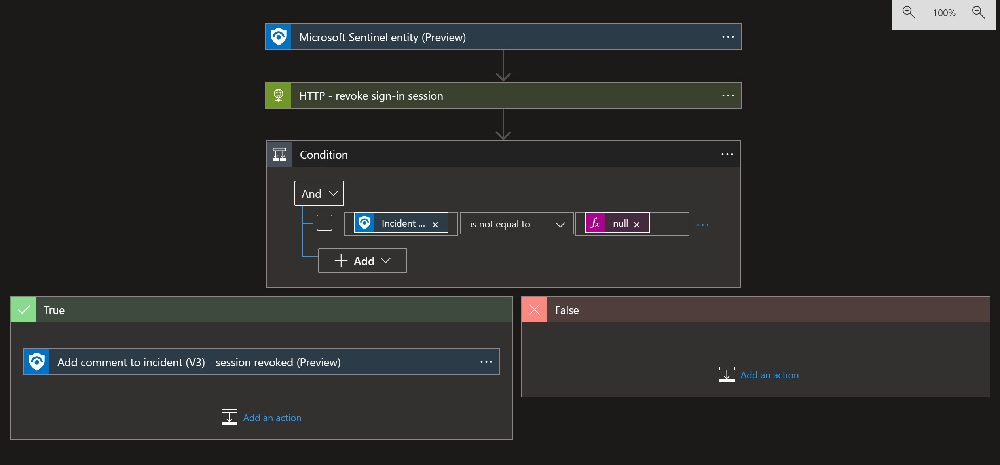

# Revoke-AADSignIn-Session-entityTrigger
author: Benji Kovacevic

This playbook will revoke user's sign-in sessions and user will have to perform authentication again. It invalidates all the refresh tokens issued to applications for a user (as well as session cookies in a user's browser), by resetting the signInSessionsValidFromDateTime user property to the current date-time.

# Prerequisites
None.

# Quick Deployment
[](https://portal.azure.com/#create/Microsoft.Template/uri/https%3A%2F%2Fraw.githubusercontent.com%2FAzure%2FAzure-Sentinel%2Fmaster%2FPlaybooks%2FRevoke-AADSignIn-Session-entityTrigger%2Fazuredeploy.json)
[](https://portal.azure.us/#create/Microsoft.Template/uri/https%3A%2F%2Fraw.githubusercontent.com%2FAzure%2FAzure-Sentinel%2Fmaster%2FPlaybooks%2FRevoke-AADSignIn-Session-entityTrigger%2Fazuredeploy.json)
<br><br>

# Post-deployment
1. Assign Microsoft Sentinel Responder role to the managed identity. To do so, choose Identity blade under Settings of the Logic App.
2. Assign User.ReadWrite.All and Directory.ReadWrite.All API permissions to the managed identity.<br>
```powershell
$MIGuid = "<Enter your managed identity guid here>"
$MI = Get-AzureADServicePrincipal -ObjectId $MIGuid

$GraphAppId = "00000003-0000-0000-c000-000000000000"
$PermissionName1 = "User.ReadWrite.All"
$PermissionName2 = "Directory.ReadWrite.All"

$GraphServicePrincipal = Get-AzureADServicePrincipal -Filter "appId eq '$GraphAppId'"
$AppRole1 = $GraphServicePrincipal.AppRoles | Where-Object {$_.Value -eq $PermissionName1 -and $_.AllowedMemberTypes -contains "Application"}
New-AzureAdServiceAppRoleAssignment -ObjectId $MI.ObjectId -PrincipalId $MI.ObjectId `
-ResourceId $GraphServicePrincipal.ObjectId -Id $AppRole1.Id

$AppRole2 = $GraphServicePrincipal.AppRoles | Where-Object {$_.Value -eq $PermissionName2 -and $_.AllowedMemberTypes -contains "Application"}
New-AzureAdServiceAppRoleAssignment -ObjectId $MI.ObjectId -PrincipalId $MI.ObjectId `
-ResourceId $GraphServicePrincipal.ObjectId -Id $AppRole2.Id
```

# Screenshots

**Playbook** <br>
<br>