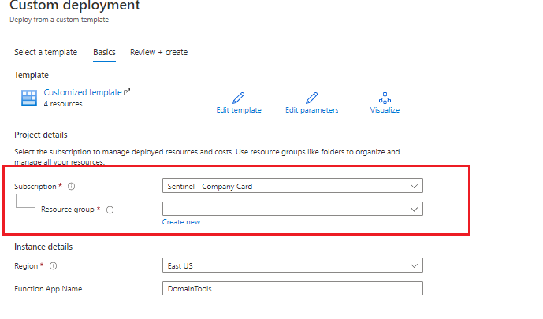
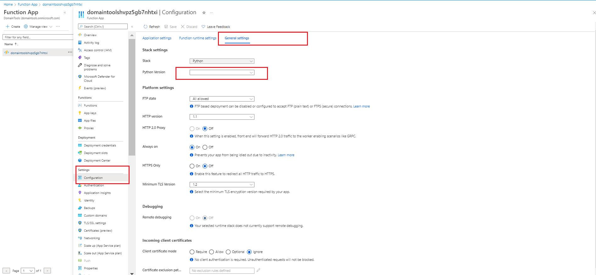
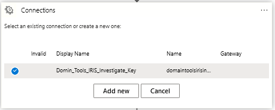

 
## DomainTools Iris Investigate URL Playbook
## Table of Contents

1. [Overview](#overview)
1. [Deploy DomainTools Iris Investigate URL Playbook](#deployplaybook)
1. [Authentication](#authentication)
1. [Prerequisites](#prerequisites)
1. [Deployment](#deployment)
1. [Post Deployment Steps](#postdeployment)

<a name="overview">

## Overview
This playbook uses the DomainTools Iris Investigate API. Given a URL or set of URLs associated with an incident, return all DomainTools Iris Investigate data for the extracted domains from the URL as comments in the incident.
 
Learn more about the Custom Connector via https://docs.microsoft.com/connectors/domaintoolsirisinves or visit https://www.domaintools.com/integrations to request an API key.

When a new Azure Sentinel Incident is created, this playbook gets triggered and performs these actions:

- It fetches all the URL objects in the Incident.
- Iterate through the URL objects, extracting the Domain from the URL using a "Function App" and fetching the results from DomaintTools Iris Investigate for each Domain.
- All the details from DomainTools Iris Investigate will be added as comments in a tabular format.
- All the response attributes that have count value(Count of connected domains sharing this attribute) greater than 1 and less than "Pivot Threshold" parameter value in the playbook(default to 500), will have a link to get more details from the DomainTools Iris Investigate UI.

<a name="deployplaybook">
 
## Links to deploy the DomainTools Function App

 

- Deploy the Function App by clicking on "Deploy to Azure" button. This will take you to deploying an ARM Template wizard.
- Provide Subscription and Resource group details.
- <strong>Note:</strong> If you wish to change the "Function App Name", please note down the name as the same "Function App Name" must be provided in the Logic App deployment as well.
 
 

#### Set Python Version in the Function App
- Go to the newly Deployed "Function App", on the left hand side pane, select "Settings>Configuration>General settings", in the "Python Vesion" dropdown select "Python 3.8" and click on Save.
- On the left hand side pane, select "Overview" and restart the "Function App".

## Links to deploy the DomainTools Iris Investigate URL Playbook

 

<a name="authentication">

## Authentication
Authentication methods this connector supports:
 - [API Key authentication](https://www.domaintools.com/integrations)

<a name="prerequisites">

## Prerequisites
- A DomainTools API Key provisioned for Iris Investigate.
- Function App should be deployed before Logic App deployment.

<a name="deployment">

### Deployment instructions
- Deploy the playbooks by clicking on "Deploy to Azure" button. This will take you to deploying an ARM Template wizard.
- Fill in the required parameters for deploying the playbook.
  
- Click "Review + create". Once the validation is successful, click on "Create".

<a name="postdeployment">

### Post-Deployment instructions
#### a. Authorize connections: 
Once deployment is complete, you will need to authorize each connection:
- Open the Logic App in the edit mode.
- Open "For each" Action.
- Provide connection details for the DomainTools Iris Investigate Custom Connector (A DomainTools API Username and API Key need to be provided).

  
- Click on "Add New", provide a name for the connection, enter your DomainTools Investigate API Username and API Key.
- Click "Create".
- Repeat these steps for any other connections and select the connection details created above.
  
- Save the Logic App. If the Logic App prompts any missing connections, please update the connections similarly.
- As a best practice, we have used the Sentinel connection in Logic Apps that use "ManagedSecurityIdentity" permissions. Please refer to [this document](https://techcommunity.microsoft.com/t5/microsoft-sentinel-blog/what-s-new-managed-identity-for-azure-sentinel-logic-apps/ba-p/2068204) and provide permissions to the Logic App accordingly.
#### b. Configurations in Sentinel:
- In Azure Sentinel, analytical rules should be configured to trigger an incident with risky Domain indicators. 
- Configure the automation rules to trigger the playbook.
